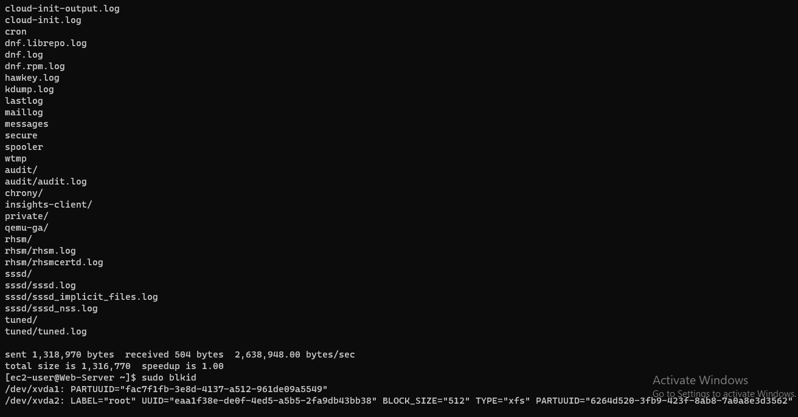
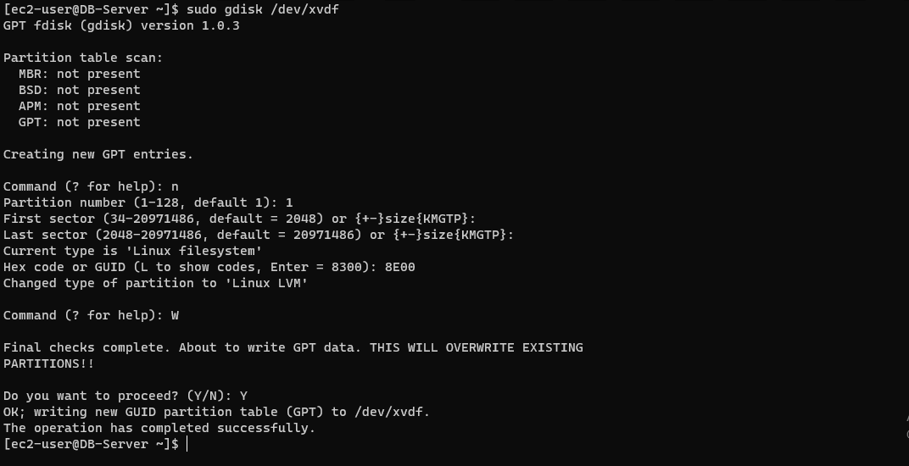
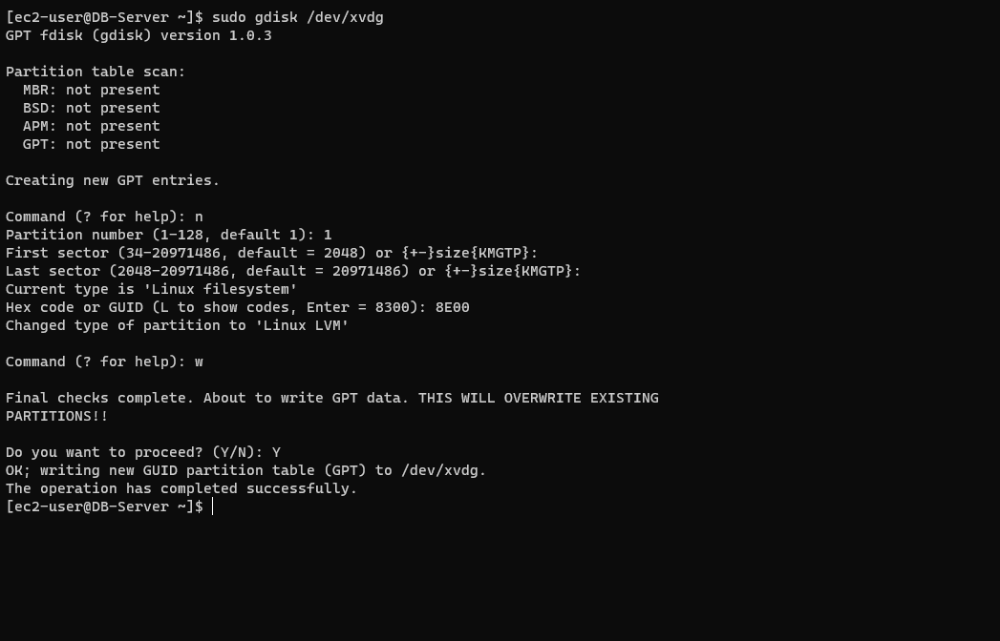
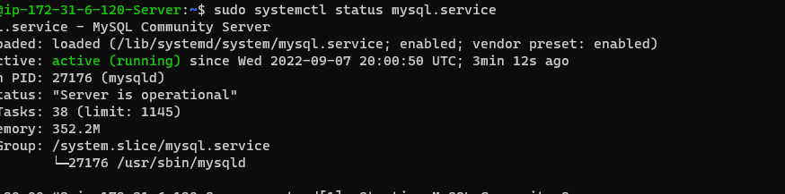

# PROJECT 6 - Web Solution With WordPress
___
____
In this project storage infrastructure will be prepared on two Linux servers for implementation of  a basic web solution using WordPress. WordPress is a free and open-source content management system written in PHP and paired with MySQL or MariaDB as its backend Relational Database Management System (RDBMS).

**Project 6 consists of two parts:**

* Configuration of  storage subsystem for Web and Database servers based on Linux OS. Here disks, partitions and volumes in Linux will be implemented.

* Installation of  WordPress and connecting  it to a remote MySQL database server. This part will showcase how to deploy Web and DB tiers of Web solution.

### **Step 1 - Setting up the RedHat Servers**
___
>#### Launch two EC2 instance. one will serve as **"Web Server"** & the other as **"Database Server"**

>#### Creating & Attaching -3- 10GiB Volumes to each Servers in the same AZ.

### **Step 2 - Preparing the Web Server**
___
>#### Checking Block Devices, Mount Volumes & Available Spaces.
#### Using *`lsblk`* & *`df-h`* command to inspect what block devices are attached to my web server and the spaces available. 

>#### Partitioning the Attached Volumes
#### Using *`gdisk`* utility to create a single partition on each of the 3 disks the command *`sudo gdisk /dev/xvdf/xvdg/xvdh`* is applied on each of the disk.

#### Using *`lsblk`* utility to view the newly configured partition on each of the 3 disks.

>#### Install *`lvm2`* package using package manager **yum**
#### Using *`sudo yum install lvm2`* to install the packages and *`sudo lvmdiskscan`* command to check for available partitions.

>####  Dealing with the Physical and Logical Volume.
#### The following set command were used set up the PV and LV
* Using **pvcreate** to create the Physical Volumes - *`sudo pvcreate /dev/xvdf1`*, *`sudo pvcreate /dev/xvdg1`* & *`sudo pvcreate/dev/xvdh1`* - Mark each of 3 disks as physical volumes (PVs) to be used by LVM
* *`sudo pvs`* - Verify that the PV has been created successfully by running
* Using **vgcreate** to create the Volume Group- *`sudo vgcreate webdata-vg /dev/xvdf1`*, *`sudo vgcreate webdata-vg /dev/xvdg1`* & *`sudo vgcreate webdata-vg/dev/xvdh1`* - adds all 3 PVs to a volume group (VG).
* *`sudo vgs`* - Verifies that the VG has been created successfully by running
* Using **lvcreate**  utility to create 2 logical volumes. **apps-lv** (Use half of the PV size), and **logs-lv** Use the remaining space of the PV size. NOTE: apps-lv will be used to store data for the Website while, logs-lv will be used to store data for logs - *`sudo lvcreate -n apps-lv -L 14G webdata-vg`* & *`sudo lvcreate -n logs-lv -L 14G webdata-vg`*
* *`sudo lvs`* - Verifies that the LV has been created successfully by running 
* *`sudo vgdisplay -v`* or *`sudo lsblk`* - views complete setup - VG, PV, and LV

* Formating the LV with mkfs.ext4 with ext4 filesystems *`sudo mkfs -t ext4 /dev/webdata-vg/apps-lv`* & *`sudo mkfs -t ext4 /dev/webdata-vg/logs-lv`*  commands are used.

>####  Creating Directories and Mounting Volumes in the Web Server.
* *`sudo mkdir -p /var/www/html`* - Creates **/var/www/html** directory to store website files.
* *`sudo mkdir -p /home/recovery/logs`* - Creates **/home/recovery/logs** to store backup of log data
* *`sudo mount /dev/webdata-vg/apps-lv /var/www/html/`* - Mount **/var/www/html** on apps-lv logical volume 
* *`sudo rsync -av /var/log/. /home/recovery/logs/`* - Creates **/home/recovery/logs** backup all the files in the log directory **/var/log** into **/home/recovery/ logs** (This is required before mounting the file system)
* *`sudo mount /dev/webdata-vg/logs-lv /var/log`* - Creates **/home/recovery/logs** - Mount /var/log on logs-lv logical volume.
  * *`sudo rsync -av /home/recovery/logs/. /var/log`* - Restore log files back into /var/log directory.
  
  
  
  >####  Updating the /etc/fstab File
* *`sudo blkid`* - Copy the **UUID** of the device which i'll be updating in the **/etc/fstab** file
* Update **/etc/fstab** with *`sudo vi /etc/fstab`* file so that the mount configuration will persist after restart of the server.
* *`sudo mount -a`* & *`sudo systemctl daemon-reload`* - Test the configuration and reload the daemon
* *`df -h`* - To Verify that the setup by running

### **Step 3 - Preparing the Database Server**
___ 
>#### Checking Block Devices, Mount Volumes & Available Spaces.
#### Using *`lsblk`* & *`df-h`* command to inspect what block devices are attached to my web server and the spaces available. 

>#### Partitioning the Attached Volumes
#### Using *`gdisk`* utility to create a single partition on each of the 3 disks the command *`sudo gdisk /dev/xvdf/xvdg/xvdh`* is applied on each of the disk.

#### Using *`lsblk`* utility to view the newly configured partition on each of the 3 disks.

>#### Install *`lvm2`* package using package manager **yum**
#### Using *`sudo yum install lvm2`* to install the packages and *`sudo lvmdiskscan`* command to check for available partitions.

>####  Dealing with the Physical and Logical Volume.
#### The following set command were used set up the PV and LV
* Using **pvcreate** to create the Physical Volumes - *`sudo pvcreate /dev/xvdf1`*, *`sudo pvcreate /dev/xvdg1`* & *`sudo pvcreate/dev/xvdh1`* - Mark each of 3 disks as physical volumes (PVs) to be used by LVM
* *`sudo pvs`* - Verify that the PV has been created successfully by running
* Using **vgcreate** to create the Volume Group- *`sudo vgcreate webdata-vg /dev/xvdf1`*, *`sudo vgcreate webdata-vg /dev/xvdg1`* & *`sudo vgcreate webdata-vg/dev/xvdh1`* - adds all 3 PVs to a volume group (VG).
* *`sudo vgs`* - Verifies that the VG has been created successfully by running
* Using **lvcreate**  utility to create 2 logical volumes. **db-lv** (Use half of the PV size), and **logs-lv** Use the remaining space of the PV size. NOTE: db-lv will be used to store data for the Database while, logs-lv will be used to store data for logs - *`sudo lvcreate -n db-lv -L 14G webdata-vg`* & *`sudo lvcreate -n logs-lv -L 14G webdata-vg`*
* *`sudo lvs`* - Verifies that the LV has been created successfully by running 
* *`sudo vgdisplay -v`* or *`sudo lsblk`* - views complete setup - VG, PV, and LV

* Formating the LV with mkfs.ext4 with ext4 filesystems *`sudo mkfs -t ext4 /dev/webdata-vg/db-lv`* & *`sudo mkfs -t ext4 /dev/webdata-vg/logs-lv`*  commands are used.

>####  Creating Directories and Mounting Volumes in the Web Server.
* *`sudo mkdir -p /var/www/html`* - Creates **/var/www/html** directory to store website files.
* *`sudo mkdir -p /home/recovery/logs`* - Creates **/home/recovery/logs** to store backup of log data
* *`sudo mount /dev/webdata-vg/apps-lv /var/www/html/`* - Mount **/var/www/html** on apps-lv logical volume 
* *`sudo rsync -av /var/log/. /home/recovery/logs/`* - Creates **/home/recovery/logs** backup all the files in the log directory **/var/log** into **/home/recovery/ logs** (This is required before mounting the file system)
* *`sudo mount /dev/webdata-vg/logs-lv /var/log`* - Creates **/home/recovery/logs** - Mount /var/log on logs-lv logical volume.
  * *`sudo rsync -av /home/recovery/logs/. /var/log`* - Restore log files back into /var/log directory.
  
  
  >####  Updating the /etc/fstab File
* *`sudo blkid`* - Copy the **UUID** of the device which i'll be updating in the **/etc/fstab** file
* Update **/etc/fstab** with *`sudo vi /etc/fstab`* file so that the mount configuration will persist after restart of the server.
* *`sudo mount -a`* & *`sudo systemctl daemon-reload`* - Test the configuration and reload the daemon
* *`df -h`* - To Verify that the setup by running

### **Step 4 — Install WordPress on my Web Server**
___
>#### To install WordPress the following series on commands are ran 
To Install wget, Apache & Dependencies
* *`sudo yum -y update`* - Updates the repository
* *`sudo yum -y install wget httpd php php-mysqlnd php-fpm php-json`* - Install wget, Apache and it’s dependencies  
* *`sudo systemctl enable httpd`* & *`sudo systemctl start httpd`* - Starts Apache

To install PHP and it’s dependencies the following commands were ran
* *`sudo yum install https://dl.fedoraproject.org/pub/epel/epel-release-latest-8.noarch.rpm`*
* *`sudo yum install yum-utils http://rpms.remirepo.net/enterprise/remi-release-8.rpm`*
* *`sudo yum module list php`*
* *`sudo yum module reset php`*
* *`sudo yum module enable php:remi-7.4`*
* *`sudo yum install php php-opcache php-gd php-curl php-mysqlnd`*
* *`sudo systemctl start php-fpm`*
* *`sudo systemctl enable php-fpm`*
* *`sudo setsebool -P httpd_execmem 1`*

Restart Apache with command
* *`sudo systemctl restart httpd`*

Download **wordpress** and copy wordpress to **var/www/html** using the following commands
* *`mkdir wordpress`*
* *`cd   wordpress`*
* *`sudo wget http://wordpress.org/latest.tar.gz`*
* *`sudo tar xzvf latest.tar.gz`*
* *`sudo rm -rf latest.tar.gz`*
* *`sudo cp wordpress/wp-config-sample.php wordpress/wp-config.php`*
* *`sudo cp -R wordpress /var/www/html/`*

Configure SELinux Policies
* *`sudo chown -R apache:apache /var/www/html/wordpress`*
* *`sudo chcon -t httpd_sys_rw_content_t /var/www/html/wordpress -R`*
* *`sudo setsebool -P httpd_can_network_connect=1`*
### **Step 5 — Install MySQL on my Database Server**
___
>#### Acquiring & Installing mysql server  using **yum** package manager
To set up the MySQL on the DB the following commands are ran.
* *`sudo yum update`* - Updated the DB Server
* *`sudo yum install mysql-server`* - Installs MySQL on the DB Server
* *`sudo systemctl status mysqld`* - Verifies that the service is up and running by using
Verify that mysql service is up and running 

### **Step 6 —  Configure DB to work with WordPress**
___
>#### To configure Database to work with Wordpree thefollowing set of command was ran.
 * *`sudo mysql`* - gives access into the MySQL
 * *`CREATE DATABASE Project_6_WORDPRESS;`* - Creates a Database named Project_6_WORDPRESS
 * *`CREATE USER `myuser`@`<Web-Server-Private-IP-Address>` IDENTIFIED BY 'password';`* - (Creates a user named 'myuser and grants it privileges to be accesed via the Web Server)
 * *`GRANT ALL ON Project_6_WORDPRESS.* TO 'myuser'@'<Web-Server-Private-IP-Address>';`* - (Give the user permission over the specified database to be accessed via the Web Server)
 * *`FLUSH PRIVILEGES;`*
 * *`SHOW DATABASES;`* -( Displays the list of Databases) 
 * *`SELECT USER FROM mysql.myuser;`* - (Displays the Test table)
 * *`exit`*

### **Step 7 — Configure WordPress to connect to remote database.**
____
>#### To configure wordpress to connect to the remote database first the inbound rules is edidted for the DB Server.
Edit inbound rule for my DB server
 The inbound rule is ediidted on  **DB Server** and port  **3306** is for MySQL. Access will be allowed for the **DB server** only from the **Web Server’s** Private IP address.

Bind-address is added on the DB server to enable remote connection by editing using *`sudo vi /etc/my.cnf`* 

>#### Next is to Install **MySQL client** on my **web server** and test remote connection from the **Web Server** to the **DB server** by using **mysql-client**
* *`sudo yum install mysql`* -(Installs mysql Clent on the Web Server)
* *`sudo mysql -u admin -p -h <DB-Server-Private-IP-address>`* -( Access the DB Server using the IP Address of the Database Server)
* *`SHOW DATABASES;`* -( Displays the list of Databases)

* Enable TCP port 80 in Inbound Rules configuration for my Web Server EC2 (enable from everywhere 0.0.0.0/0)

* Using vi editor, i edit **wp-config.php** file in the worpress folder to update the DB name, user name. password and DB host private IP address. using command  *`cd /var/www/html/wordpress/wordpress`* & *`sudo vi wp-config.php`*
>#### Connect to the Wordpress via the browser
Access from the browser the link to my WordPress using my **web server** public IP Address http://13.42.66.202/wordpress/

## Project End